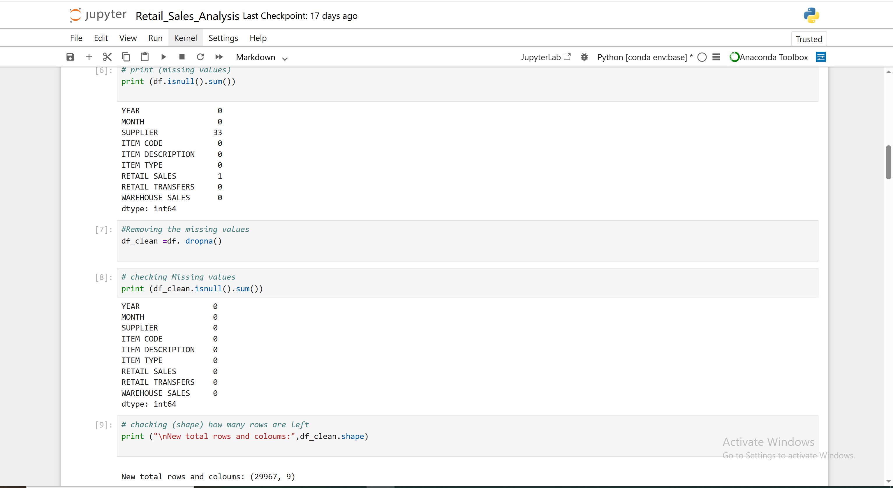

# Retail Sales Analysis Using Python

## Executive Summary
This project performs exploratory data analysis (EDA) on retail sales data to identify revenue trends, category performance, and customer purchasing behavior. The analysis was conducted using Python to transform raw data into actionable business insights.

---

## Business Problem
Retail businesses require analytical insights to:
- Monitor revenue performance
- Identify top-performing product categories
- Detect seasonal trends
- Understand sales distribution patterns

The objective was to build a structured data analysis workflow to support data-driven decision-making.

---

## Tools & Libraries Used
- Python
- Pandas
- NumPy
- Matplotlib
- Seaborn
- Jupyter Notebook

---

## Data Analysis Workflow

### 1. Data Cleaning
- Checked for missing values
- Removed duplicates
- Standardized column formats
- Converted date fields for time-series analysis

### 2. Exploratory Data Analysis
- Revenue trend analysis (monthly/yearly)
- Category-wise sales contribution
- Regional sales distribution
- Customer purchase frequency analysis

### 3. Data Visualization
- Line charts for revenue trends
- Bar charts for category comparison
- Distribution plots for sales patterns
- Heatmaps for correlation analysis

---

## Key Insights Generated
- Identified peak sales periods and seasonal demand trends.
- Highlighted top-performing product categories.
- Detected underperforming regions impacting revenue.
- Observed revenue concentration patterns across time periods.

---

## Business Impact
The analysis framework provides:
- Clear revenue performance visibility
- Category optimization opportunities
- Data-backed strategic planning support
- Scalable analytical foundation for predictive modeling

---
## Visualizations Preview

---

## Skills Demonstrated
- Data Cleaning & Transformation
- Exploratory Data Analysis
- Statistical Interpretation
- Data Visualization
- Business Insight Generation
